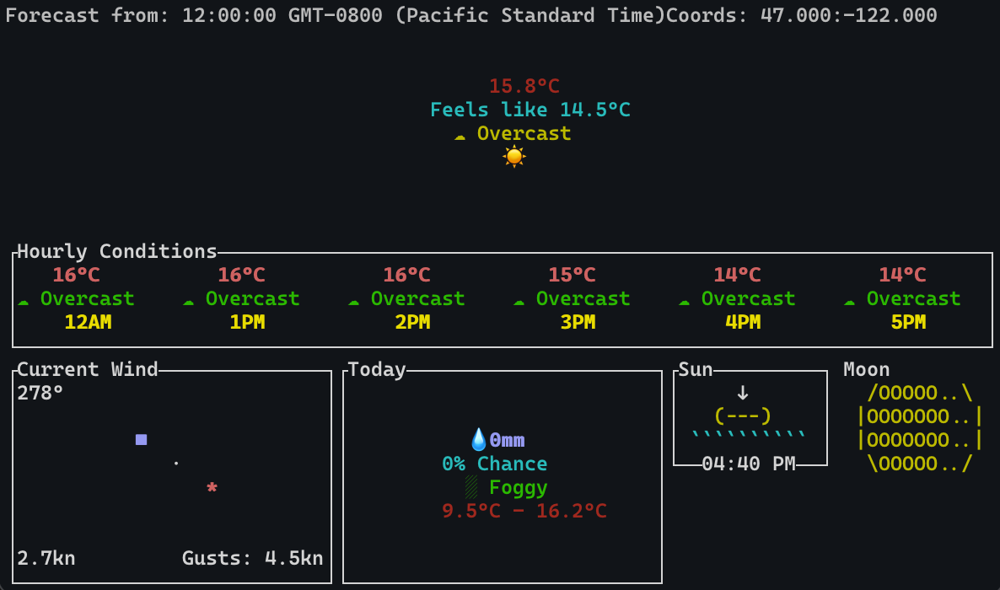
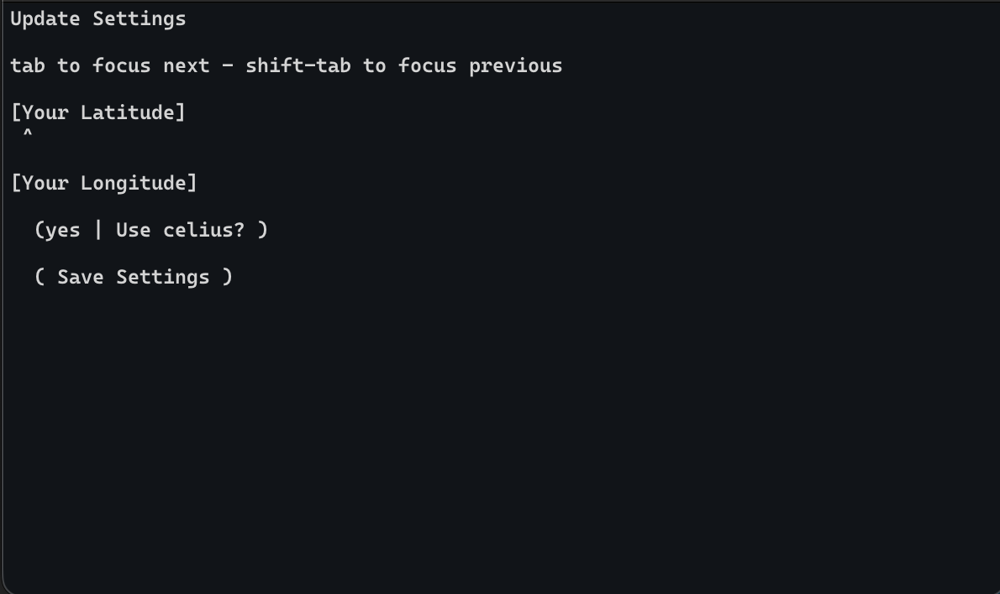
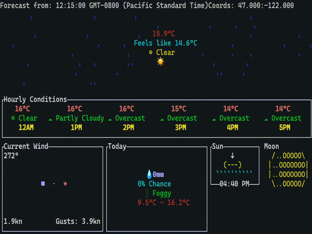

# weathertui

A small little weather app that runs in the terminal.

## theme

This follows the theme for week 10 (grid) because it uses a grid based auto-layout for all the modules.

## Features

- Onboarding screen for user settings (location and units) (saves the settings)
- Automatic updating through a free weather API
- Caches weather data and only updates when it needs to
- Cool animations and color for different weather
- Auto-layout interface

### Weather Modules

- **Current Weather** with animations depending on the weather
- **Hourly conditions** (auto resizes with terminal)
- **Wind** (has a compass that rotates depending on the wind direction)
- **Daily Overview** (displays useful information for that day)
- **Sunset/Sunrise** (displays sunset or sunrise time and visual, depending on whether it is day or night)
- **Moon Phases** calculates the moon phase and displays it in a nice little visual

### Grid Layout System

I needed to have an framework for modules so i could easily add more, so I designed a *grid* based layout system. It auto resizes to the terminal window and automatically hides modules if they dont fit. You can see the implementation in [block.ts](../blob/master/src/types/block.ts).

## Usage

You can install it using `npm install -g weathertui`.  

Then run it using `weathertui`.

First run will prompt you to enter your location (in decimal coordinates) and whether you want to use Celcius or Fahrenheit

use `weathertui -s` to change your settings again.

You can also run by cloning the repo and running the scripts.

## Tech stack

- Uses typescript for all the logic
- Runs on node.js
- Uses open-meteo for weather data

Note: If your terminal is in light mode, you might not be able to see the snow animation (because snow is white)
